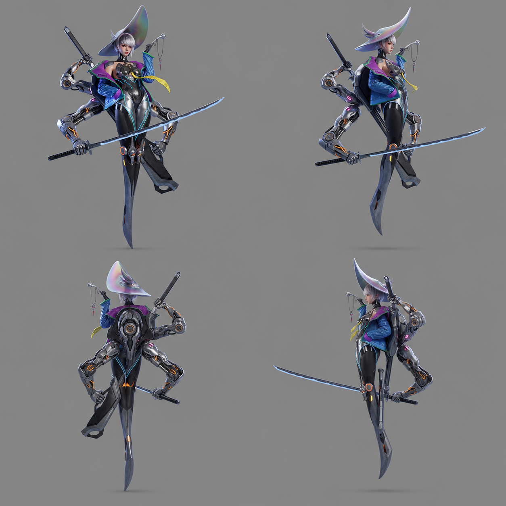
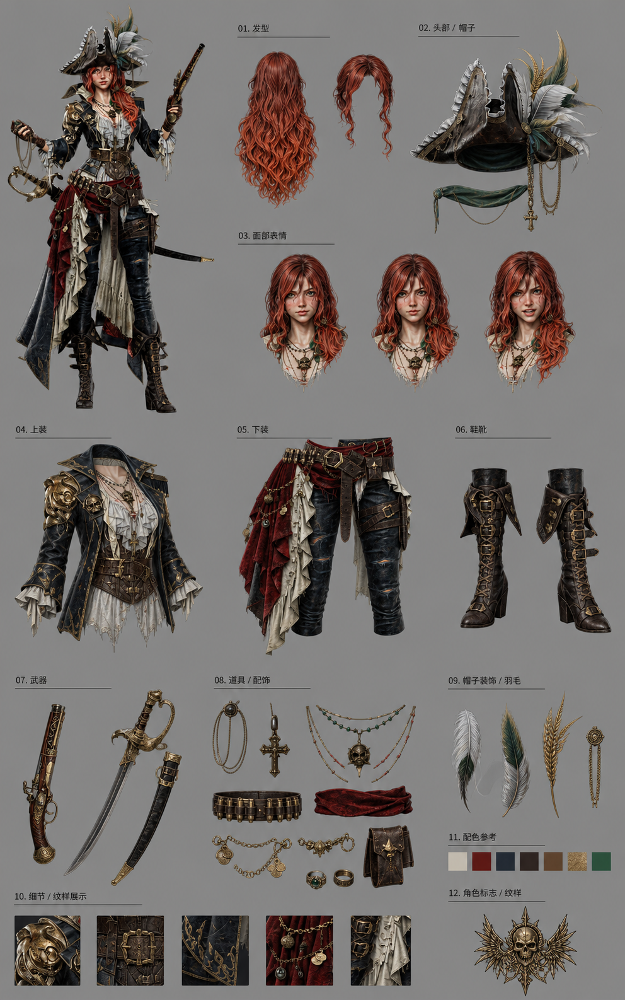
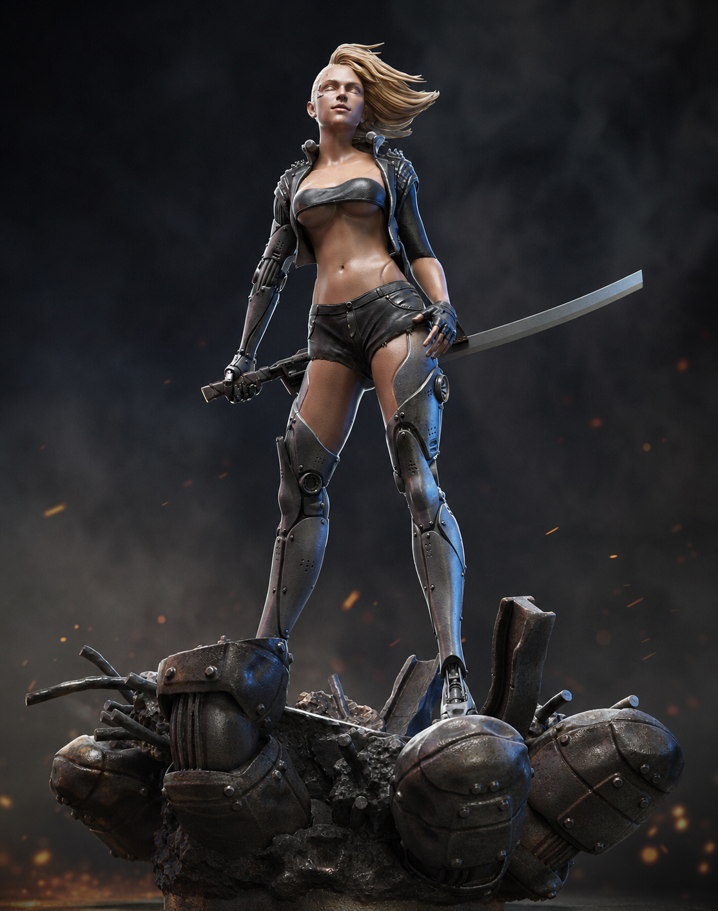
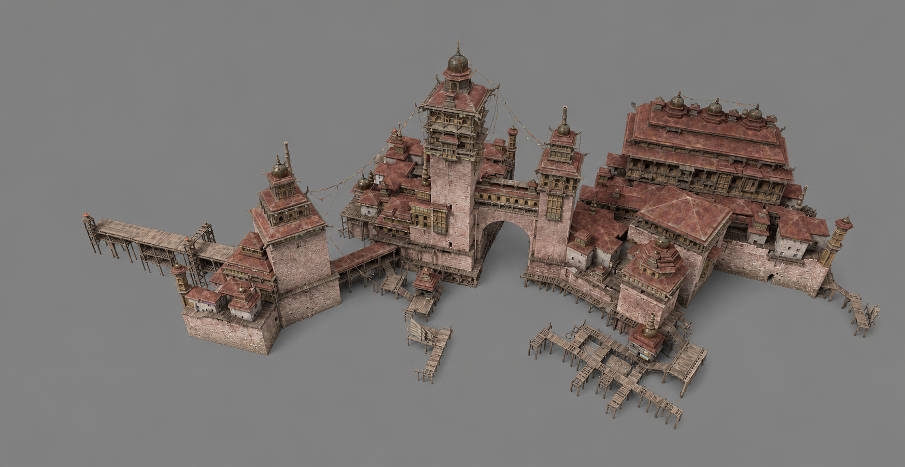

# Awesome Game Prompts 🎮

[English](./README.en.md)

> 游戏美术提示词库：浏览效果，复制即用。

为角色、场景、原画、UI、特效与 3D 美术整理的可复用提示词。每条提示词都配有参考效果；进入网站即可展开全文并一键复制。

## 浏览分类

- 角色设计
- 场景设计
- 原画设计
- UI / UX 美术
- 动画与特效
- 3D 建模 / 贴图 / 渲染

## 精选提示词与效果

| 效果 | 提示词 | 用途 |
| --- | --- | --- |
|  | [经典四视图](./src/generated/prompts.json) | 统一比例与材质的角色建模参考。 |
|  | [角色设定拆解](./src/generated/prompts.json) | 一页展示发型、服装、道具与表情。 |
|  | [白模渲染](./src/generated/prompts.json) | 将白模转为照片级材质与灯光效果。 |
|  | [3D 建筑轴测图](./src/generated/prompts.json) | 以等轴测角度清晰呈现建筑结构。 |

## 使用方式

1. 在网站按分类浏览效果。
2. 展开提示词，确认它适合你的素材与目标。
3. 点击“复制提示词”，粘贴到你使用的图像模型中，再按项目需求调整。

提示词原文保留创作时的语言与细节；请结合自己的参考图、模型能力和商用要求使用。

## 一起补充

欢迎提交经过实际验证的游戏美术提示词和对应效果图。请说明适用场景，并保留足够的上下文，让其他创作者也能复现和改造。