# Awesome Game Prompts 🎮

[English](./README.en.md)

> 把 AI 出图变成可检查、可复用、可交接的游戏美术工作流。

为角色、场景、原画、UI、特效与 3D 美术整理的实测提示词与组合流程。每条提示词保留原始文本和参考效果；工作流进一步定义阶段输入、输出、验收门槛和最终交付清单。

[打开网站](https://plevantem.github.io/awesome-game-prompt/) · [角色生产工作流](https://plevantem.github.io/awesome-game-prompt/workflows/character-production/)

## 不只是提示词图库

单张效果图无法回答生产环节最难的问题：同一角色换视角后是否仍然一致、建模师拿到什么、哪一步失败、应当重跑哪一环。

首个组合流程蓝图把现有提示词串成一条 6 阶段路径：

`角色补全 → 设计拆解 → 经典四视图 → T Pose → 可控变体 → 灰模参考`

每一阶段都有验收标准，并附有一段面向 GPT-6 ASTRA 等工具型智能体的编排提示。ASTRA 部分目前是可执行蓝图，不声称已经完成端到端基准测试。

## 证据边界

- 网站中的样图来自仓库已有提示词记录。
- “实测”表示提示词附有实际生成结果，不表示它在所有模型、素材和生产条件下都稳定。
- 页面中的阶段样图来自不同提示词记录，并非同一角色端到端跑通，不能证明跨阶段一致性。
- GPT-6 ASTRA 部分目前展示流程编排方式；完整的耗时、成本、成功率与人工干预次数仍待基准测试。
- 本仓库内容采用 [MIT 许可证](./LICENSE)。

## 更新记录

### 2026-09-10

- 年龄段衍生补充生成效果图；服饰衍生、发型衍生与体型衍生补充效果图。
- README 改为展示当前全部 28 条提示词；其中 25 条已有首张效果图，3 条待补。

### 2026-09-09

- 新增角色设计提示词：服饰衍生、发型衍生、年龄段衍生、体型衍生。
- 新增 3D / 场景设计提示词：拆件创意组合。
- 拆件创意组合已补充效果图；其余条目的样图以网站记录为准。

## 浏览分类

- 角色设计
- 场景设计
- 原画设计
- UI / UX 美术
- 动画与特效
- 3D 建模 / 贴图 / 渲染

## 使用方式

1. 在网站按分类浏览效果。
2. 展开提示词，确认它适合你的素材与目标。
3. 点击“复制提示词”，粘贴到你使用的图像模型中，再按项目需求调整。

提示词原文保留创作时的语言与细节；请结合自己的参考图、模型能力和商用要求使用。

## 精选提示词与效果

提示词名称会打开 GitHub Pages 的详情页；在页面中点击“复制提示词”即可复制。每条已有样图的提示词均使用独立缩略图，完整效果请在详情页查看；没有样图的条目明确标为“待补效果图”。

| 分类 | 用途 | 提示词 | 效果 |
| --- | --- | --- | --- |
| UI / UX 美术 | 用于等轴模块化游戏场景组件设定。 | [生成UI组件](https://plevantem.github.io/awesome-game-prompt/prompt/ui-unf2tf/) | [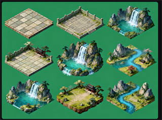](https://plevantem.github.io/awesome-game-prompt/prompt/ui-unf2tf/) |
| UI / UX 美术 | 轻奇幻模拟经营游戏的完整界面设计。 | [生成UI界面](https://plevantem.github.io/awesome-game-prompt/prompt/ui-un3hhi/) | [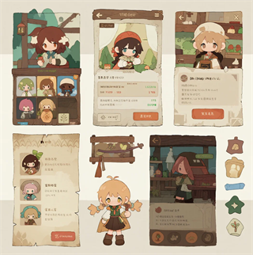](https://plevantem.github.io/awesome-game-prompt/prompt/ui-un3hhi/) |
| 原画设计 / 场景设计 | 写实国风游戏场景的概念设计。 | [生成场景概念](https://plevantem.github.io/awesome-game-prompt/prompt/prompt-un2m9l/) | [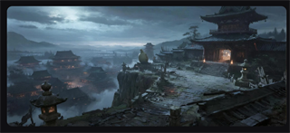](https://plevantem.github.io/awesome-game-prompt/prompt/prompt-un2m9l/) |
| 角色设计 | 基于 FACS 的角色面部表情变化。 | [表情衍生](https://plevantem.github.io/awesome-game-prompt/prompt/prompt-5pyhf1/) | [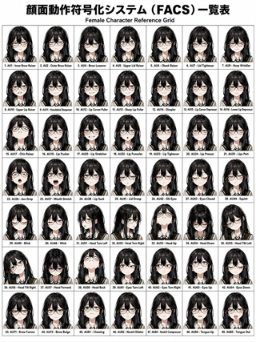](https://plevantem.github.io/awesome-game-prompt/prompt/prompt-5pyhf1/) |
| UI / UX 美术 | 游戏英雄选择界面与角色展示。 | [英雄选择UI界面](https://plevantem.github.io/awesome-game-prompt/prompt/ui-eng3bk/) | [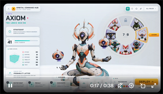](https://plevantem.github.io/awesome-game-prompt/prompt/ui-eng3bk/) |
| 角色设计 | 带英文标注的 2D 动画角色设定页。 | [角色 character sheet](https://plevantem.github.io/awesome-game-prompt/prompt/character-sheet-ajd0va/) | [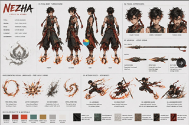](https://plevantem.github.io/awesome-game-prompt/prompt/character-sheet-ajd0va/) |
| 角色设计 / 动画与特效 | 九格黑白动作分镜与镜头节奏。 | [黑白分镜故事板](https://plevantem.github.io/awesome-game-prompt/prompt/prompt-rg7vlq/) | [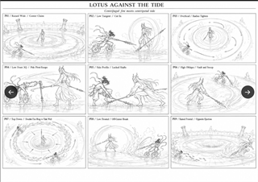](https://plevantem.github.io/awesome-game-prompt/prompt/prompt-rg7vlq/) |
| 原画设计 / 场景设计 | 提取参考图的视觉风格并转写为提示词。 | [风格DNA提取](https://plevantem.github.io/awesome-game-prompt/prompt/dna-a31mz3/) | 待补效果图 |
| 角色设计 / 3D 建模 / 贴图 / 渲染 / 场景设计 | 在三视图之外补充一处关键细节特写。 | [三视图+特写](https://plevantem.github.io/awesome-game-prompt/prompt/prompt-xktmy5/) | [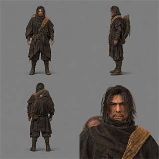](https://plevantem.github.io/awesome-game-prompt/prompt/prompt-xktmy5/) |
| 角色设计 | 统一比例与材质的角色建模参考。 | [经典四视图](https://plevantem.github.io/awesome-game-prompt/prompt/prompt-b0f3js/) | [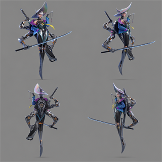](https://plevantem.github.io/awesome-game-prompt/prompt/prompt-b0f3js/) |
| 角色设计 | 标准 T 字姿势，用于比例测量与骨骼绑定。 | [T Pose](https://plevantem.github.io/awesome-game-prompt/prompt/t-pose-lufduf/) | [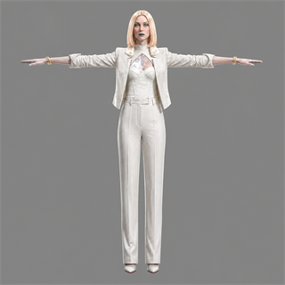](https://plevantem.github.io/awesome-game-prompt/prompt/t-pose-lufduf/) |
| 角色设计 | 标准 A 字姿势，用于肩臂和服装走向参考。 | [A Pose](https://plevantem.github.io/awesome-game-prompt/prompt/a-pose-mbw756/) | [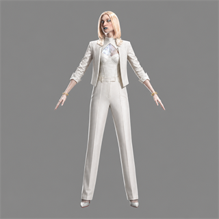](https://plevantem.github.io/awesome-game-prompt/prompt/a-pose-mbw756/) |
| 角色设计 | 拆解发型、服装、道具与表情。 | [角色设定拆解](https://plevantem.github.io/awesome-game-prompt/prompt/prompt-mi2rst/) | [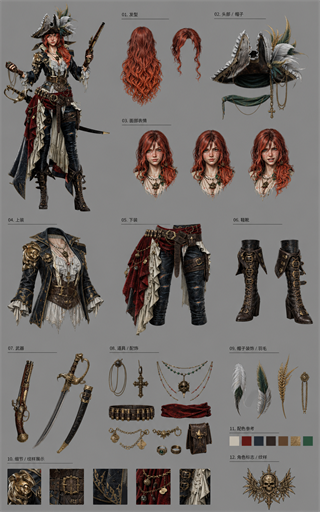](https://plevantem.github.io/awesome-game-prompt/prompt/prompt-mi2rst/) |
| 角色设计 | 补全被裁切或遮挡的角色全身信息。 | [角色补全](https://plevantem.github.io/awesome-game-prompt/prompt/prompt-pywn1f/) | [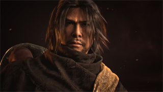](https://plevantem.github.io/awesome-game-prompt/prompt/prompt-pywn1f/) |
| 3D 建模 / 贴图 / 渲染 | 为白模赋予写实材质与灯光。 | [白模渲染](https://plevantem.github.io/awesome-game-prompt/prompt/prompt-r2igzf/) | [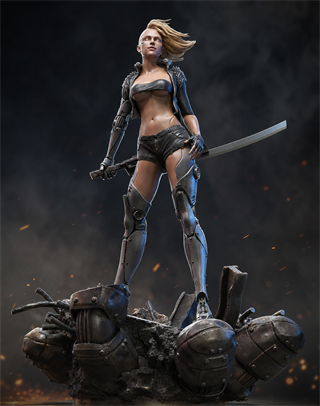](https://plevantem.github.io/awesome-game-prompt/prompt/prompt-r2igzf/) |
| 3D 建模 / 贴图 / 渲染 | 提取主体并转成中性灰高模参考。 | [提取主体转灰模](https://plevantem.github.io/awesome-game-prompt/prompt/prompt-d93pto/) | [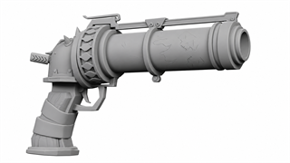](https://plevantem.github.io/awesome-game-prompt/prompt/prompt-d93pto/) |
| 原画设计 | 分析并延展参考图的视觉风格。 | [同风格延展](https://plevantem.github.io/awesome-game-prompt/prompt/prompt-by5nve/) | [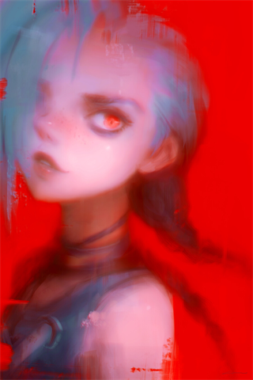](https://plevantem.github.io/awesome-game-prompt/prompt/prompt-by5nve/) |
| 3D 建模 / 贴图 / 渲染 | 以等轴测角度清晰呈现建筑结构。 | [3D建筑轴测图](https://plevantem.github.io/awesome-game-prompt/prompt/d-vd2val/) | [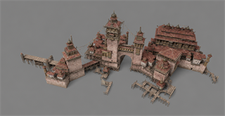](https://plevantem.github.io/awesome-game-prompt/prompt/d-vd2val/) |
| 场景设计 / 角色设计 / 原画设计 | 转为简化线稿，便于结构分析与建模。 | [图转手绘](https://plevantem.github.io/awesome-game-prompt/prompt/prompt-kk3hes/) | [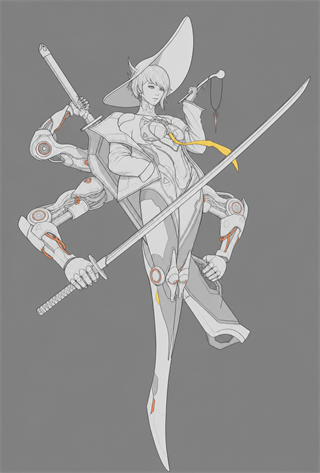](https://plevantem.github.io/awesome-game-prompt/prompt/prompt-kk3hes/) |
| 3D 建模 / 贴图 / 渲染 | 移除装饰花纹，保留造型和结构。 | [材质花纹移除](https://plevantem.github.io/awesome-game-prompt/prompt/prompt-qj21qv/) | [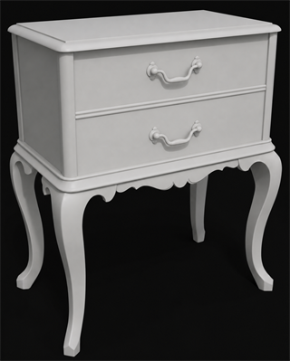](https://plevantem.github.io/awesome-game-prompt/prompt/prompt-qj21qv/) |
| 3D 建模 / 贴图 / 渲染 | 将图像主体拆分为可用的 3D 游戏资产。 | [3D拆件](https://plevantem.github.io/awesome-game-prompt/prompt/d-e1i4rx/) | [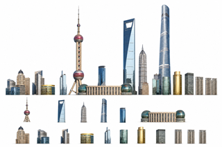](https://plevantem.github.io/awesome-game-prompt/prompt/d-e1i4rx/) |
| 原画设计 / 动画与特效 | 融合多张图的代表性风格特征。 | [风格融合](https://plevantem.github.io/awesome-game-prompt/prompt/prompt-xzsmbv/) | 待补效果图 |
| 原画设计 | 为作品集输出概念创意与设计说明。 | [概念创意说明](https://plevantem.github.io/awesome-game-prompt/prompt/prompt-mwjzzg/) | [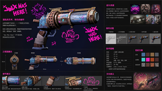](https://plevantem.github.io/awesome-game-prompt/prompt/prompt-mwjzzg/) |
| 角色设计 | 同一角色的四套主题服饰穿搭。 | [服饰衍生](https://plevantem.github.io/awesome-game-prompt/prompt/outfit-sheet-260909/) | [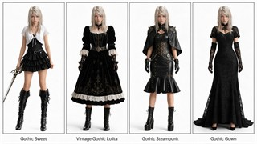](https://plevantem.github.io/awesome-game-prompt/prompt/outfit-sheet-260909/) |
| 角色设计 | 同一角色的九种个性化发型。 | [发型衍生](https://plevantem.github.io/awesome-game-prompt/prompt/hairstyle-sheet-260909/) | [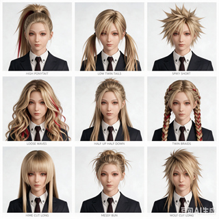](https://plevantem.github.io/awesome-game-prompt/prompt/hairstyle-sheet-260909/) |
| 角色设计 | 同一角色从幼年到老年的年龄对照。 | [年龄段衍生](https://plevantem.github.io/awesome-game-prompt/prompt/age-variants-260909/) | [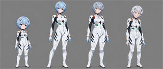](https://plevantem.github.io/awesome-game-prompt/prompt/age-variants-260909/) |
| 角色设计 | 同一角色从极瘦到肥胖的体型变化。 | [体型衍生](https://plevantem.github.io/awesome-game-prompt/prompt/body-variants-260909/) | [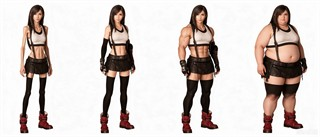](https://plevantem.github.io/awesome-game-prompt/prompt/body-variants-260909/) |
| 3D 建模 / 贴图 / 渲染 / 场景设计 | 将素材拆件后重组为 3D 场景创意。 | [拆件创意组合](https://plevantem.github.io/awesome-game-prompt/prompt/asset-kitbash-260909/) | [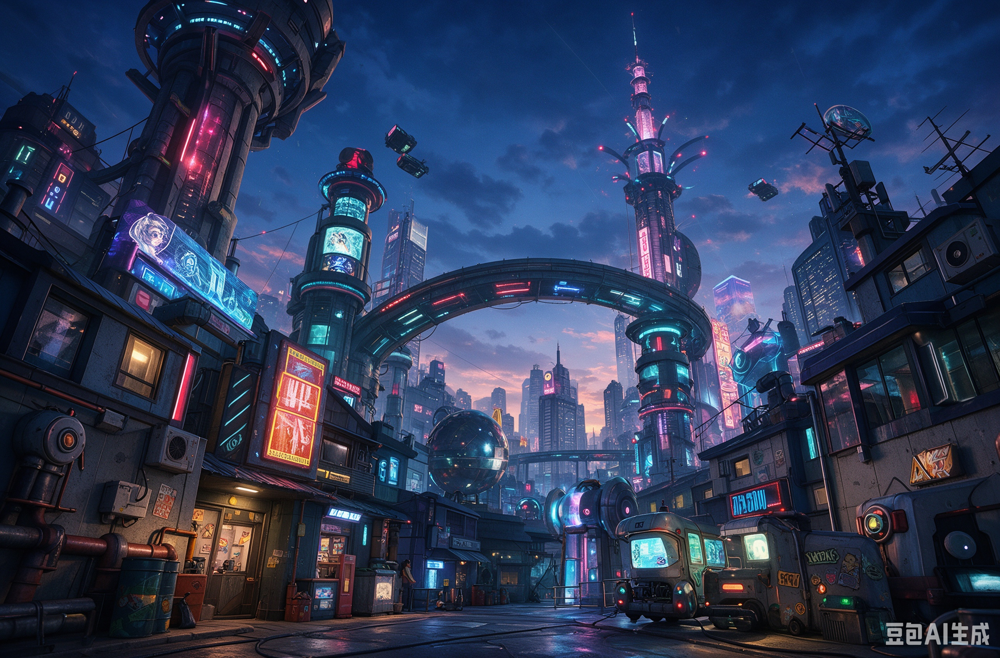](https://plevantem.github.io/awesome-game-prompt/prompt/asset-kitbash-260909/) |

## 一起补充

优先提交可复现的[工作流失败案例](https://github.com/PlevanTem/awesome-game-prompt/issues/new?template=workflow-failure.yml)：指出失败阶段、模型版本、输入条件、违反的验收标准和重试过程。

仓库许可证尚未确定，目前先不要通过 PR 提交需要授权的提示词或图片内容。许可证明确后再开放内容贡献流程。
